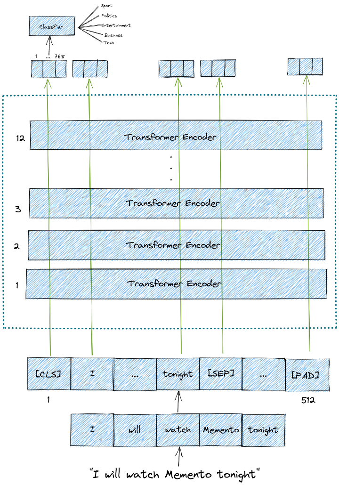

# MachineLearning-DeepLearning
<h2>Fine Tuning MARBERT for Multiclass Text Classification<a href="https://github.com/ziadelsayed0/MachineLearning-DeepLearning/blob/main/NLP/Topic-Classification-For-Arabic-Language_Marbert_PyTorch_Fine_tuning.ipynb" class="anchor-link">¶</a></h2>

<ur>
  <li>Model - 'MARBERT'</li>
  <li>Dataset called 'MergedTopics' collected from separated text files</li>
</ur>
<div data-mime-type="text/markdown" class="jp-RenderedHTMLCommon jp-RenderedMarkdown jp-MarkdownOutput">
  <h2 id="First-What-is-BERT?">First What is BERT?</h2><p>BERT stands for Bidirectional Encoder Representations from Transformers. The name itself gives us several clues to what BERT is all about.</p>
  <p>BERT architecture consists of several Transformer encoders stacked together. Each Transformer encoder encapsulates two sub-layers: a self-attention layer and a feed-forward layer.</p>
  <h3 id="There-are-two-different-BERT-models:">There are two different BERT models:</h3><ul>
  <li><p>BERT base, which is a BERT model consists of 12 layers of Transformer encoder, 12 attention heads, 768 hidden size, and 110M parameters.</p>
  </li>
  <li><p>BERT large, which is a BERT model consists of 24 layers of Transformer encoder,16 attention heads, 1024 hidden size, and 340 parameters.</p>
  </li>
  </ul>
  <p>BERT Input and Output
  BERT model expects a sequence of tokens (words) as an input. In each sequence of tokens, there are two special tokens that BERT would expect as an input:</p>
  <ul>
  <li>[CLS]: This is the first token of every sequence, which stands for classification token.</li>
  <li>[SEP]: This is the token that makes BERT know which token belongs to which sequence. This special token is mainly important for a next sentence prediction task or question-answering task. If we only have one   sequence, then this token will be appended to the end of the sequence.</li>
  </ul>
  <p>It is also important to note that the maximum size of tokens that can be fed into BERT model is 512. If the tokens in a sequence are less than 512, we can use padding to fill the unused token slots with [PAD]   token. If the tokens in a sequence are longer than 512, then we need to do a truncation.</p>
  <p>And that’s all that BERT expects as input.</p>
  <p>BERT model then will output an embedding vector of size 768 in each of the tokens. We can use these vectors as an input for different kinds of NLP applications, whether it is text classification, next           sentence prediction, Named-Entity-Recognition (NER), or question-answering.</p>
  <hr>
  <p><strong>For a text classification task</strong>, we focus our attention on the embedding vector output from the special [CLS] token. This means that we’re going to use the embedding vector of size 768 from      [CLS] token as an input for our classifier, which then will output a vector of size the number of classes in our classification task.</p>
  <hr>
  <p>Bert Architecture</p>
  <hr>

  ## ARBERT & MARBERT: Deep Bidirectional Transformers for Arabic


## What is the repository is about?
This is the repository accompanying our project [ARBERT & MARBERT: Deep Bidirectional Transformers for Arabic].
* introduce ```ARBERT``` and ```MARBERT```, two powerful Transformer-based language models for Arabic;
* introduce ```ArBench```, a multi-domain, multi-variety benchmark for Arabic naturaal language understanding based on 41 datasets across 5 different tasks and task clusters;
* evaluate ARBERT and MARBERT on ArBench and compare against available language models.

Our models establish new state-of-the-art (SOTA) on all 5 tasks/task clusters on 37 out of the 41 datasets.
Our language models are publicaly available for research (see below).
The rest of this repository provides more information about our new language models, benchmark, and experiments.
## How to use ARBERT and MARBERT

### Loading directly from Huggingface
You can use ARBERT and MARBERT with [Hugging Face's Transformers](https://github.com/huggingface/transformers) library as follow.
 
 ```python
    from transformers import AutoTokenizer, AutoModel
    #load AEBERT model from huggingface
    ARBERT_tokenizer = AutoTokenizer.from_pretrained("UBC-NLP/ARBERT")
    ARBERT_model = AutoModel.from_pretrained("UBC-NLP/ARBERT")
  
    #load MAEBERT model from huggingface
    MARBERT_tokenizer = AutoTokenizer.from_pretrained("UBC-NLP/MARBERT")
    MARBERT_model = AutoModel.from_pretrained("UBC-NLP/MARBERT") 
 ```
### 4.2 Example: Fine-tuning MARBERT for Sentiment Analysis
MARBERT Fine-Tuning demo with PyTorch checkpoint for Sentiment Analysis on the AJGT dataset [](https://colab.research.google.com/drive/1M0ls7EPUi1dwqIDh6HNfJ5y826XvcgGX?usp=sharing)
</div>
